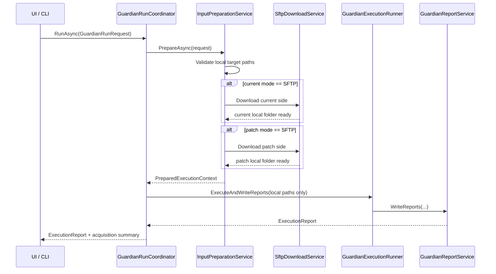

# NexusWorks.Guardian SFTP 입력 수집 옵션 상세 설계

> 작성일: 2026-03-13
> 대상: `NexusWorks.Guardian`, `NexusWorks.Guardian.UI`, `NexusWorks.Guardian.Cli`
> 목적: 원본(current)과 비교(patch) 입력을 옵션으로 SFTP에서 각각 내려받아 로컬 폴더에 준비한 뒤 기존 Guardian 비교 엔진으로 실행할 수 있게 하는 상세 설계

## 1. 문서 목적

현재 Guardian은 로컬 파일 시스템의 `current root`와 `patch root`를 직접 비교하는 구조다. 본 문서는 이 구조를 깨지 않고, 실행 전 단계에 `SFTP 다운로드 기반 입력 준비`를 추가하는 방안을 정리한다.

핵심 목표는 다음과 같다.

- 원본(current) 입력과 비교(patch) 입력을 각각 `Local` 또는 `SFTP` 방식으로 선택할 수 있게 한다.
- SFTP를 선택한 입력은 지정한 로컬 폴더에 다운로드한 뒤 기존 비교 엔진에 그대로 넘긴다.
- 기존 `GuardianComparisonEngine`의 로컬 비교 책임은 유지한다.
- UI, CLI, 실행 이력, 리포트, 테스트까지 포함한 변경 범위를 명확히 한다.

## 2. 현행 구조 검토

### 2.1 현재 실행 구조

현재 실행 흐름은 아래와 같다.

1. UI `Home.razor` 또는 CLI가 `GuardianRunRequest` 수준의 입력을 만든다.
2. `GuardianWorkbenchService` 또는 CLI가 `ComparisonExecutionRequest`를 만든다.
3. `GuardianExecutionRunner`가 `GuardianComparisonEngine.Execute()`를 호출한다.
4. 비교 엔진은 `CurrentRootPath`, `PatchRootPath`, `BaselinePath`가 모두 로컬 경로라고 가정한다.
5. 비교 완료 후 HTML/Excel/JSON/로그를 출력한다.

현재 구조상 SFTP를 비교 엔진 내부로 집어넣는 것은 적절하지 않다. 이유는 다음과 같다.

- `GuardianComparisonEngine`는 로컬 디렉터리 스캔과 규칙 기반 비교에 집중하고 있다.
- 비교 엔진에 원격 접속 책임을 넣으면 네트워크 장애, 인증, 재시도, 보안 저장소 같은 관심사가 섞인다.
- UI와 CLI가 모두 같은 원격 입력 준비 로직을 재사용해야 하므로, 비교 엔진 아래가 아니라 실행 오케스트레이션 위에 놓는 편이 맞다.

### 2.2 현행 코드 기준 확장 포인트

- `src/NexusWorks.Guardian.UI/Components/Pages/Home.razor`
  - 현재/패치/베이스라인/출력 경로 입력과 실행 준비도 계산 담당
- `src/NexusWorks.Guardian.UI/Services/GuardianWorkbenchService.cs`
  - UI 실행 요청을 비교 러너로 전달
- `src/NexusWorks.Guardian/Models/DomainModels.cs`
  - `ComparisonExecutionRequest`, `ComparisonOptions`
- `src/NexusWorks.Guardian/Orchestration/GuardianExecutionRunner.cs`
  - 타임아웃과 보고서 생성 책임
- `src/NexusWorks.Guardian/Reporting/*`
  - 실행 보고서, 이력, 아티팩트 생성
- `src/NexusWorks.Guardian.Cli/Program.cs`
  - CLI 옵션 해석과 실행 진입점

### 2.3 검토 결론

SFTP 기능 추가는 가능하다. 다만 핵심 비교 로직 수정량은 작고, 실제 작업량은 아래 영역에 집중된다.

- 실행 요청 모델 확장
- 실행 전 입력 준비 오케스트레이션 추가
- SFTP 인증/보안 저장소 설계
- UI 입력 폼 확장
- CLI 옵션 확장
- 실행 리포트/이력에 SFTP 준비 메타데이터 반영

즉, 이 기능은 `비교 엔진 기능 추가`가 아니라 `입력 수집 파이프라인 추가`로 보는 것이 정확하다.

## 3. 요구사항 정의

### 3.1 기능 요구사항

- 원본(current)과 비교(patch) 입력 각각에 대해 `Local` 또는 `SFTP`를 선택할 수 있어야 한다.
- SFTP 선택 시 다음 정보를 입력할 수 있어야 한다.
  - 호스트
  - 포트
  - 사용자명
  - 인증 방식
  - 원격 루트 경로
  - 로컬 다운로드 대상 폴더
- 원본과 비교 입력은 서로 다른 SFTP 서버/계정/원격 경로를 가질 수 있어야 한다.
- 동일 서버를 쓰는 경우 설정을 공유하거나 복사할 수 있어야 한다.
- 다운로드 완료 후 기존 비교 로직은 로컬 폴더 기준으로 그대로 동작해야 한다.
- SFTP를 사용하지 않는 기존 로컬 실행 흐름은 그대로 유지되어야 한다.

### 3.2 비기능 요구사항

- 비밀번호와 개인키는 결과 JSON, 실행 로그, 최근 경로 저장소에 남지 않아야 한다.
- 실행 시간에는 SFTP 다운로드 시간이 포함되어야 한다.
- 다운로드 실패 시 비교는 시작하지 않아야 한다.
- 원본 폴더와 비교 폴더는 서로 독립적으로 검증되고 실패 사유가 분리되어야 한다.
- UI와 CLI 모두 동일한 준비 로직을 사용해야 한다.

### 3.3 비범위

- baseline.xlsx를 SFTP에서 읽는 기능
- 원격 서버에 업로드하는 기능
- 증분 다운로드, resume, delta sync
- symlink 완전 추적
- 여러 원격 루트를 하나의 입력에 병합 다운로드하는 기능

## 4. 권장 UX

### 4.1 입력 단위

글로벌 `입력 모드` 하나를 두기보다, `원본 입력`과 `비교 입력` 각각의 모드를 가지는 방식이 더 적합하다.

권장 이유:

- current는 로컬, patch만 SFTP인 시나리오를 지원할 수 있다.
- current와 patch가 다른 서버에 있어도 모델이 자연스럽다.
- "원본과 비교 폴더에 각각 다운로드"라는 요구를 그대로 반영할 수 있다.

### 4.2 UI 구성

`Home.razor`의 현재 `Current root`, `Patch root` 입력은 각 입력 카드로 확장한다.

권장 카드 구성:

| 카드 | 필드 | 설명 |
|---|---|---|
| 원본 입력 | 입력 방식(Local/SFTP), 로컬 대상 폴더 | 기존 `CurrentRootPath` 대체 |
| 원본 입력 - SFTP | Host, Port, Username, Auth, Remote Root, Host Fingerprint | SFTP 선택 시 노출 |
| 비교 입력 | 입력 방식(Local/SFTP), 로컬 대상 폴더 | 기존 `PatchRootPath` 대체 |
| 비교 입력 - SFTP | Host, Port, Username, Auth, Remote Root, Host Fingerprint | SFTP 선택 시 노출 |
| 공통 입력 | Baseline, Output root, Report title | 기존 유지 |

추가 UX 요소:

- `Use same SFTP connection as current`
  - patch 입력에서 current의 Host/Port/Username/Auth를 복사
  - patch는 Remote Root만 별도 입력
- `Clear target before download`
  - 비어있지 않은 로컬 대상 폴더를 비우고 다시 다운로드
- `Test connection`
  - 호스트 키 확인과 자격 증명 검증
- `Preview remote root`
  - 파일 수, 최상위 폴더 목록 정도만 경량 조회

### 4.3 로컬 대상 폴더 정책

SFTP 입력의 로컬 대상 폴더는 Guardian 비교 엔진이 직접 읽는 최종 폴더로 사용한다.

즉:

- 원본 SFTP 입력의 로컬 대상 폴더 = 실행 시 `CurrentRootPath`
- 비교 SFTP 입력의 로컬 대상 폴더 = 실행 시 `PatchRootPath`

권장 정책:

- 기본값은 `폴더가 비어 있어야 함`
- 사용자가 `Clear target before download`를 명시한 경우에만 정리 허용
- 아래 경로는 차단
  - 홈 디렉터리 루트
  - 드라이브 루트
  - 시스템 디렉터리
  - output root와 동일 경로
  - current와 patch가 동일 경로

## 5. 권장 아키텍처

### 5.1 설계 원칙

- 비교 엔진은 로컬 비교 전용으로 유지
- 원격 수집은 오케스트레이션 레이어에서 처리
- 비밀 정보는 실행 중 메모리 또는 보안 저장소에서만 관리
- 실행 리포트에는 정제된 메타데이터만 남김

### 5.2 신규 레이어

`NexusWorks.Guardian` 내부에 `Acquisition/` 폴더를 추가한다.

권장 구조:

```text
src/NexusWorks.Guardian/
  Acquisition/
    IInputPreparationService.cs
    InputPreparationService.cs
    InputSpecification.cs
    PreparedExecutionContext.cs
    Sftp/
      ISftpClientFactory.cs
      SftpClientFactory.cs
      ISftpDownloadService.cs
      SftpDownloadService.cs
      SftpConnectionOptions.cs
      SftpSidePreparationResult.cs
      DownloadTargetGuard.cs
```

### 5.3 핵심 컴포넌트

| 컴포넌트 | 책임 |
|---|---|
| `IInputPreparationService` | 실행 전 current/patch 입력을 실제 로컬 폴더로 준비 |
| `InputPreparationService` | Local 입력은 검증만, SFTP 입력은 다운로드 수행 |
| `ISftpDownloadService` | SFTP 접속, 원격 트리 순회, 파일 다운로드 |
| `DownloadTargetGuard` | 다운로드 대상 폴더의 안전성 검증 |
| `PreparedExecutionContext` | 준비 완료된 로컬 current/patch 경로와 실행 메타데이터 제공 |
| `GuardianRunCoordinator` | 입력 준비 -> 비교 실행 -> 리포트 작성 전체 흐름 오케스트레이션 |

### 5.4 실행 시퀀스



## 6. 도메인 모델 설계

### 6.1 상위 실행 요청 모델

권장 모델은 `current/patch`를 각각 독립 입력으로 가지는 형태다.

```csharp
public enum InputMode
{
    Local,
    Sftp
}

public enum InputSide
{
    Current,
    Patch
}

public sealed record InputSourceSpec(
    InputSide Side,
    InputMode Mode,
    string LocalRootPath,
    SftpInputSpec? Sftp = null);

public sealed record GuardianRunRequest(
    InputSourceSpec CurrentInput,
    InputSourceSpec PatchInput,
    string BaselinePath,
    string OutputRootPath,
    string ReportTitle,
    ComparisonOptions? ComparisonOptions = null);
```

### 6.2 SFTP 입력 모델

비밀 정보와 영속 정보를 분리한다.

```csharp
public enum SftpAuthMethod
{
    Password,
    PrivateKey
}

public sealed record SftpConnectionProfile(
    string ProfileId,
    string Host,
    int Port,
    string Username,
    SftpAuthMethod AuthMethod,
    string RemoteRootPath,
    string? HostFingerprintSha256,
    string? PrivateKeyPath,
    bool ClearTargetBeforeDownload);

public sealed record SftpSecretMaterial(
    string? Password,
    string? PrivateKeyPassphrase);

public sealed record SftpInputSpec(
    SftpConnectionProfile Profile,
    SftpSecretMaterial Secret);
```

설계 원칙:

- `SftpConnectionProfile`은 결과 문서에 남아도 되는 수준의 정보만 가진다.
- `SftpSecretMaterial`은 런타임에서만 사용하고 직렬화 금지 처리한다.
- UI 저장 시 비밀번호는 `SecureStorage`에 저장하고 프로필에는 `ProfileId`만 유지한다.
- CLI는 비밀번호를 인자 문자열로 직접 받지 않고 환경 변수명을 통해 주입한다.

### 6.3 준비 완료 컨텍스트

```csharp
public sealed record PreparedInputSide(
    InputSide Side,
    InputMode Mode,
    string EffectiveLocalRootPath,
    PreparedInputSideSummary Summary);

public sealed record PreparedExecutionContext(
    PreparedInputSide Current,
    PreparedInputSide Patch,
    string BaselinePath,
    string OutputRootPath,
    string ReportTitle,
    ComparisonOptions ComparisonOptions,
    ExecutionPerformanceSummary PreparationPerformance);
```

`PreparedExecutionContext`가 생기면 비교 엔진은 기존처럼 로컬 경로만 받으면 된다.

## 7. 실행 오케스트레이션 설계

### 7.1 신규 오케스트레이터

`GuardianExecutionRunner`는 현재 `ComparisonExecutionRequest`를 바로 실행한다. 이를 유지하고, 그 위에 `GuardianRunCoordinator`를 추가하는 방식을 권장한다.

권장 책임 분리:

- `GuardianRunCoordinator`
  - 고수준 실행 요청 수신
  - current/patch 입력 준비
  - 준비 시간 측정
  - 로컬 비교 요청 생성
  - 정제된 실행 메타데이터를 리포트에 반영
- `GuardianExecutionRunner`
  - 기존 비교 + 리포트 쓰기 책임 유지

### 7.2 권장 흐름

1. `GuardianRunCoordinator.RunAsync(GuardianRunRequest request)`
2. `InputPreparationService.PrepareAsync()` 호출
3. `PreparedExecutionContext` 생성
4. `ComparisonExecutionRequest`로 변환
5. `GuardianExecutionRunner.ExecuteAndWriteReports()` 호출
6. 결과 보고서에 `InputAcquisitionSummary` 병합

## 8. SFTP 다운로드 상세 설계

### 8.1 패키지 선택

권장안:

- `NexusWorks.Guardian.csproj`에 `SSH.NET` 직접 추가

비권장안:

- `SuperTutty` 프로젝트를 참조해 기존 SSH 클래스를 재사용

이유:

- Guardian은 비교 도메인이고 SuperTutty는 터미널/세션 도메인이다.
- Guardian이 SuperTutty에 의존하면 프로젝트 경계가 흐려진다.
- 현재 SuperTutty 쪽 SSH 모델은 세션/쉘 중심이며 SFTP 다운로드와 수명 관리 요구가 다르다.

### 8.2 다운로드 정책

MVP 정책:

- 원격 루트 아래 전체 파일을 재귀 다운로드
- 디렉터리 구조는 그대로 유지
- regular file만 다운로드
- symlink는 건너뛰고 경고에 기록
- 마지막 수정 시각은 가능하면 로컬 파일에 반영

### 8.3 대상 폴더 준비

다운로드 시작 전 `DownloadTargetGuard`가 아래를 검사한다.

- 경로가 비어 있지 않은가
- current/patch가 동일 경로인가
- 위험 경로인가
- `ClearTargetBeforeDownload`가 false인데 기존 파일이 존재하는가

권장 규칙:

- 빈 폴더면 그대로 사용
- 폴더가 존재하지 않으면 생성
- 폴더가 비어있지 않고 `ClearTargetBeforeDownload = false`이면 실패
- 폴더가 비어있지 않고 `ClearTargetBeforeDownload = true`이면 전체 비우기 후 다운로드

### 8.4 다운로드 알고리즘

1. SFTP 연결 생성
2. Host key fingerprint 검증
3. Remote root 존재 여부 확인
4. Remote root 재귀 순회
5. 디렉터리 생성
6. 파일 스트림 다운로드
7. 다운로드 파일 수, 바이트 수, 실패 수 집계
8. 결과 요약 반환

### 8.5 오류 정책

권장 정책은 `side-fail-fast`다.

- current 다운로드 실패 시 실행 전체 실패
- patch 다운로드 실패 시 실행 전체 실패
- 다운로드 실패 후 비교 시작 금지

이유:

- 한쪽 입력만 준비된 상태에서 비교하면 결과 신뢰도가 없다.
- 누락/부분 다운로드를 비교 결과와 섞으면 원인 분석이 어려워진다.

## 9. 보안 설계

### 9.1 자격 증명 저장

UI:

- Host / Port / Username / RemoteRoot / Fingerprint는 일반 설정으로 저장 가능
- Password / Passphrase는 `SecureStorage.Default` 사용
- 최근 경로 저장소(`guardian-recent-paths.json`)에는 절대 저장하지 않음

CLI:

- `--current-sftp-password-env`, `--patch-sftp-password-env` 같은 env var 이름만 받음
- 실제 비밀번호는 환경 변수에서 읽음
- 커맨드라인 히스토리에 직접 비밀번호가 남지 않도록 함

### 9.2 결과 및 로그 마스킹

다음 정보는 출력 금지:

- 비밀번호
- 개인키 내용
- 패스프레이즈

다음 정보는 선택적으로 출력:

- Host
- Port
- Username
- Remote root
- Fingerprint

권장 기본 정책:

- JSON/HTML/Excel에는 Host, Port, Username, Remote root는 남겨도 됨
- 단, 필요 시 `Mask remote endpoint in report` 옵션으로 마스킹 가능하도록 확장 여지 확보

### 9.3 호스트 키 검증

MVP에서도 반드시 들어가야 할 항목이다.

권장 정책:

- 프로필에 `HostFingerprintSha256`가 있으면 반드시 일치해야 연결 허용
- 값이 없으면 `Test connection` 단계에서 확인된 fingerprint를 사용자에게 보여주고 저장
- 저장된 fingerprint가 바뀌면 실행 차단

## 10. UI 상세 설계

### 10.1 `Home.razor` 변경 포인트

기존 단일 텍스트 입력 2개를 아래 구조로 바꾼다.

- 원본 입력 카드
  - Mode: `Local` / `SFTP`
  - Local root path
  - SFTP fields
- 비교 입력 카드
  - Mode: `Local` / `SFTP`
  - Local root path
  - SFTP fields

### 10.2 실행 준비도 계산

기존 `RunReadiness`는 아래 조건을 추가로 반영해야 한다.

- Local 모드
  - 로컬 폴더 존재 또는 생성 가능
- SFTP 모드
  - Host/Port/Username/RemoteRoot 입력
  - Secret 확보
  - Host fingerprint 확인
  - Local target path 안전성 통과

### 10.3 최근 입력/프로필 저장

기존 `RecentPathKind`는 로컬 폴더 경로만 담당하게 유지한다.

SFTP용 신규 저장소:

- `ISftpProfileStore`
  - Host, Port, Username, RemoteRoot, Fingerprint 저장
- `ISftpSecretStore`
  - ProfileId 기준 비밀번호/패스프레이즈 저장

이렇게 분리하면 현재 `RecentPathStore`에 원격 경로를 억지로 넣지 않아도 된다.

## 11. CLI 상세 설계

### 11.1 옵션 설계

권장 CLI 예시:

```bash
dotnet run --project src/NexusWorks.Guardian.Cli -- \
  --current-mode sftp \
  --current-root /work/current \
  --current-sftp-host 10.0.0.10 \
  --current-sftp-port 22 \
  --current-sftp-username deploy \
  --current-sftp-password-env CURRENT_SFTP_PASSWORD \
  --current-sftp-remote-root /release/current \
  --current-sftp-fingerprint SHA256:xxxx \
  --patch-mode sftp \
  --patch-root /work/patch \
  --patch-sftp-host 10.0.0.11 \
  --patch-sftp-port 22 \
  --patch-sftp-username deploy \
  --patch-sftp-password-env PATCH_SFTP_PASSWORD \
  --patch-sftp-remote-root /release/patch \
  --patch-sftp-fingerprint SHA256:yyyy \
  --baseline /data/baseline.xlsx \
  --output-root /data/output \
  --report-title "Guardian SFTP Run"
```

로컬 모드 호환:

- 기존 `--current-root`, `--patch-root`, `--baseline`, `--output-root`는 그대로 유지
- `--current-mode`, `--patch-mode` 기본값은 `local`

### 11.2 CLI 검증 규칙

- `mode == sftp`이면 side별 SFTP 필수 인자 검사
- env var 미존재 시 즉시 실패
- current/patch root는 로컬 대상 폴더로 해석

## 12. 리포트 및 이력 설계

### 12.1 왜 별도 메타데이터가 필요한가

현재 `ExecutionReport`는 `ComparisonExecutionRequest`만 저장한다. 여기에 비밀 정보를 포함시키면 `results.json`에 자격 증명이 남을 수 있다.

따라서 비교 요청과 별개로, 정제된 입력 준비 요약을 저장하는 구조가 필요하다.

### 12.2 권장 보고 모델

```csharp
public sealed record InputAcquisitionSummary(
    string Mode,
    IReadOnlyList<InputAcquisitionSideSummary> Sides,
    ExecutionPerformanceSummary PreparationPerformance);

public sealed record InputAcquisitionSideSummary(
    string Side,
    string InputMode,
    string EffectiveLocalRootPath,
    string? Host,
    int? Port,
    string? Username,
    string? RemoteRootPath,
    int DownloadedFileCount,
    long DownloadedBytes,
    bool ClearedTargetBeforeDownload,
    IReadOnlyList<string> Warnings);
```

`ExecutionReport`에는 아래처럼 추가하는 것을 권장한다.

```csharp
public sealed record ExecutionReport(
    string ReportTitle,
    ComparisonExecutionRequest Request,
    ComparisonExecutionResult Result,
    ExecutionSummary Summary,
    ExecutionArtifacts Artifacts,
    InputAcquisitionSummary? InputAcquisition = null);
```

### 12.3 UI/HTML/Excel 반영 포인트

- HTML hero/meta 영역에 `Input Source: Local / SFTP`
- side별 메타:
  - Local root
  - Remote host
  - Remote root
  - Downloaded file count / bytes
  - Warning count
- Excel `SUMMARY` 시트에 acquisition 섹션 추가
- JSON 결과에 `inputAcquisition` 노드 추가

### 12.4 이력 리스트 반영

`ExecutionHistoryEntry`에는 최소 아래 추가를 권장한다.

- `InputModeSummary`
  - 예: `current=SFTP, patch=Local`

이 값은 최근 실행 목록에서 로컬 실행과 SFTP 실행을 빠르게 구분하는 데 유용하다.

## 13. 성능 설계

### 13.1 실행 시간 집계

다운로드 시간이 요약 카드와 notice 메시지에 포함되어야 한다.

권장 방식:

- 준비 단계의 `ExecutionStageMetric`
  - `Current Download`
  - `Patch Download`
- 비교 단계의 기존 metric
  - `Baseline Load`
  - `Current Inventory Scan`
  - `Patch Inventory Scan`
  - `Candidate Compare`

이를 합쳐 최종 `ExecutionSummary.StageMetrics`에 넣는다.

### 13.2 병렬성

MVP에서는 side 단위 병렬 다운로드를 선택 사항으로 둔다.

권장 기본:

- current 다운로드
- patch 다운로드
- 그 다음 비교 실행

이유:

- 네트워크/디스크 병목과 서버 부하를 단순하게 통제 가능
- 장애 추적이 쉽다

향후 확장:

- current/patch side 병렬 다운로드
- 한 side 내부 파일 병렬 다운로드 제한

## 14. 테스트 설계

### 14.1 단위 테스트

- `DownloadTargetGuardTests`
  - 위험 경로 차단
  - 동일 current/patch 경로 차단
  - 비어있지 않은 폴더 정책 검증
- `InputPreparationServiceTests`
  - Local 입력 passthrough
  - SFTP 입력 준비 성공/실패
  - current만 SFTP, patch는 Local
- `ExecutionReportSerializationTests`
  - password/private key가 JSON에 직렬화되지 않는지 검증
- `CliOptionParsingTests`
  - side별 mode/SFTP 인자 해석 검증

### 14.2 통합 테스트

권장 방식:

- `ISftpDownloadService` 하위는 mockable adapter로 감싸고 대부분은 fake 기반 테스트
- 실제 SFTP smoke test는 선택적 장비/컨테이너 기반으로 별도 분리

MVP에서 꼭 필요한 통합 시나리오:

- current=SFTP, patch=Local 실행 성공
- current=SFTP, patch=SFTP 실행 성공
- host fingerprint 불일치로 실패
- target folder not empty 정책 실패

### 14.3 회귀 테스트

기존 `GuardianComparisonEngineTests`, `ExecutionHistoryStoreTests`, `ReportGenerationTests`는 그대로 유지되어야 한다.

즉, SFTP 추가 이후에도 `ComparisonExecutionRequest`에 로컬 경로만 넣으면 기존 테스트는 깨지지 않아야 한다.

## 15. 구현 단계 제안

### Phase 1. 모델 및 오케스트레이션

- `GuardianRunRequest` 확장
- `GuardianRunCoordinator` 추가
- `PreparedExecutionContext` 추가
- 리포트 모델에 `InputAcquisitionSummary` 추가

### Phase 2. SFTP 코어

- `SSH.NET` 추가
- `ISftpDownloadService` 구현
- Host key 검증
- Target folder guard 구현

### Phase 3. CLI

- side별 mode/SFTP 옵션 추가
- env var 기반 secret 로딩
- SFTP 실행 smoke 검증

### Phase 4. UI

- `Home.razor` 입력 카드 구조 개편
- SecureStorage 연동
- Test connection / readiness 반영
- patch side의 connection reuse UX 추가

### Phase 5. 리포트/이력/테스트

- HTML/Excel/JSON 메타데이터 추가
- History badge 추가
- 회귀 테스트와 신규 테스트 추가

## 16. 주요 결정사항

### 결정 1. SFTP는 비교 엔진이 아니라 준비 단계에 둔다

이 결정은 필수다. 비교 엔진 내부에 원격 접속을 넣으면 책임이 과도하게 섞인다.

### 결정 2. 입력 모드는 side별로 가진다

글로벌 모드보다 side별 모드가 요구사항과 실제 운영 시나리오에 더 잘 맞는다.

### 결정 3. Secret은 별도 저장소로 분리한다

현재 `ExecutionReport`와 최근 경로 저장 구조를 그대로 쓰면 비밀번호 유출 위험이 생긴다. 따라서 프로필과 시크릿 분리는 필수다.

### 결정 4. 로컬 대상 폴더는 dedicated working folder로 본다

비어있지 않은 폴더에 무조건 덮어쓰는 방식은 위험하다. 초기 버전은 전용 폴더 정책과 명시적 clear 옵션으로 제한하는 것이 안전하다.

## 17. 최종 권장안

최종 권장 구현 방향은 아래와 같다.

- `GuardianComparisonEngine`는 수정 최소화
- `GuardianRunCoordinator` + `InputPreparationService`를 새로 추가
- current/patch 입력을 각각 `Local` 또는 `SFTP`로 선택 가능하게 모델링
- SFTP 비밀 정보는 UI에서는 `SecureStorage`, CLI에서는 env var로만 주입
- 결과 리포트에는 정제된 acquisition summary만 저장
- 로컬 대상 폴더는 `current`와 `patch` 각각 별도 전용 폴더로 운영

이 설계는 기존 Guardian의 강점인 `로컬 비교 엔진의 단순성`을 유지하면서, 실제 운영에서 필요한 원격 수집 기능을 가장 낮은 결합도로 추가하는 방법이다.
